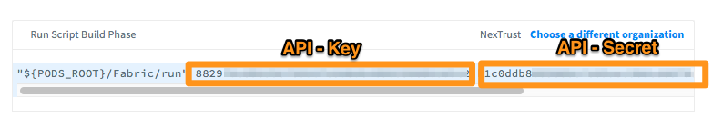

# NativeScript Fabric Plugin  

[](https://greenkeeper.io/)
[](https://travis-ci.org/hypery2k/nativescript-fabric)
[](http://badge.fury.io/js/nativescript-fabric)

Plugin is still **WIP**

[](https://nodei.co/npm/nativescript-fabric/)

> Feel free to **donate**
> 
> <a href='http://www.pledgie.com/campaigns/33053'></a>
> <a target="_blank" href="https://www.paypal.com/cgi-bin/webscr?cmd=_s-xclick&hosted_button_id=AGPGLZYNV6Y5S">
> 
> </img></a>
> Or donate [Bitcoins](bitcoin:3NKtxw1SRYgess5ev4Ri54GekoAgkR213D).
> 
> Also via [greenaddress](https://greenaddress.it/pay/GA3ZPfh7As3Gc2oP6pQ1njxMij88u/)

# Usage


## Installation

```
$ tns plugin add nativescript-fabric
```

Or if you want to use the development version (nightly build), which maybe not stable!:

```
$ tns plugin add nativescript-fabric@next
```


Go to [Crashlytics](https://fabric.io/kits/ios/crashlytics/install) and pick of the needed API-Key and API-Secret:



Create a file fabric.json in the project root folder and add the API-Key and API-Secret: 

```
{
    "apiKey": "",
    "apiSecret": ""
}
```

### Android

Add the API-Key to your AndroidManifest.xml:

```
<?xml version="1.0" encoding="UTF-8" standalone="yes"?>
<manifest xmlns:android="http://schemas.android.com/apk/res/android" package="__PACKAGE__" android:versionCode="385" android:versionName="1.0.14">
 ....
  <application android:name="com.tns.NativeScriptApplication" android:allowBackup="true" android:icon="@drawable/icon" android:label="@string/app_name" android:theme="@style/AppTheme">
    ...
    <meta-data android:name="io.fabric.ApiKey" android:value="**<API-KEY>**"/>
  </application>
</manifest>

```

### iOS

Add the API Key in the Info.plist:
```
  <key>Fabric</key>
  <dict>
    <key>APIKey</key>
    <string>xxx</string>
    <key>Kits</key>
    <array>
      <dict>
        <key>KitInfo</key>
        <dict/>
        <key>KitName</key>
        <string>Answers</string>
      </dict>
      <dict>
        <key>KitInfo</key>
        <dict/>
        <key>KitName</key>
        <string>Crashlytics</string>
      </dict>
    </array>
  </dict>
```

## Additional information

### Android 

For more details see [fabric.io/kits/android/crashlytics](https://fabric.io/kits/android/crashlytics/install).

### iOS

For more details see [fabric.io/kits/ios/crashlytics](https://fabric.io/kits/ios/crashlytics/manual-install?step=1).

## API

Init the plugin in your app (for angular apps use main.ts):

```
import { Fabric } from 'nativescript-fabric';
Fabric.init();
```

Afterwards you can use the instance methods for logging (general error logging is already added):
* `Fabric.logSignUp(method: string, success: boolean);`
* `Fabric.logLogin(method: string, success: boolean);`
* `Fabric.logContentView(id: string, name: string, type: string)`
* `Fabric.logCustomEvent(withName: string, customAttributes: Map<String, String>)`
* `Fabric.logError(error: any, msg?: string)`


## Angular

```
import { FabricModule } from 'nativescript-fabric/angular';

NgModule({
  ...
  imports: [
    FabricModule.forRoot()
  ],

```
